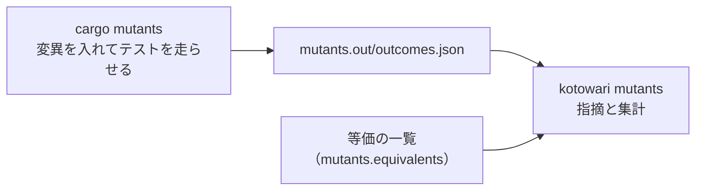

# kotowari mutants

[English](mutants.md) | 日本語

変異テストの道具（今は cargo-mutants）が書いた結果のファイルを読み、テストが気づかなかった変更（見逃し）を指摘として出します。
`kotowari check` が「要求にテストが付いているか」を見るのに対して、こちらは「そのテストが本当に実装を縛っているか」を見ます。
変異テストを走らせた後、結果を判定するときに使います。

## 書式

<!-- @kotowari[REQ-core-149:1ac13c99, REQ-core-002:f86e2efd, EX-core-244:e4a4c37f] -->

```sh
kotowari mutants --tool cargo-mutants [--format json|text] [--config <path>] <結果のファイル>
```

`--tool` は省略できません。
オプションはコマンドの前にも、結果のファイルの後にも書けます（`kotowari --tool cargo-mutants mutants outcomes.json --format text` も同じ意味です）。

## オプションと引数

<!-- @kotowari[REQ-core-149:1ac13c99, REQ-core-021:ccedd28b, REQ-core-011:0b7f52a9, REQ-core-003:8ac6759c] -->

| 名前 | 値 | 既定 | 説明 |
|---|---|---|---|
| `<結果のファイル>` | パス | なし（必須） | 変異テストの道具が書いた結果のファイル。ちょうど1つ。カレントディレクトリからの相対パスとして読む。cargo-mutants なら `mutants.out/outcomes.json` |
| `--tool` | `cargo-mutants` | なし（必須） | 結果のファイルを書いた道具。今受ける値は `cargo-mutants` だけ |
| `--format` | `json` か `text` | `json` | 出力の形 |
| `--config` | パス | 基準のディレクトリの `.kotowari/config.yaml` | 設定ファイル。カレントディレクトリからの相対パスとして読む。`mutants.equivalents`（等価の一覧の置き場）を読むために使う |
| `--help` / `--version` | なし | | 使い方か版を出して終わる |

## 読むもの

<!-- @kotowari[REQ-core-147:7559338c, EX-core-210:e791ccb1] -->

変異テストの実行そのものは kotowari の外にあります。
kotowari は、道具が書き終えた結果のファイルを読むだけです。



読むのは次のファイルだけです。

- 設定ファイル
- 結果のファイル
- 等価の一覧（設定の `mutants.equivalents` が指すもの）
- 変異の結果が指すソースのファイルと、等価の一覧の1件の `file` が指すファイル

IR、テストのファイル、判断の記録は読まず、`check` の検査もしません。
設定の `ir` や `decisions.records` の指す先が無くても止まりません。
そのため、見逃しは要求には結び付かず、ソースの場所（ファイルと行）と変更の説明で出ます。
要求へ戻るのは、見逃しを調べる人か LLM の仕事です（[見逃しが出たら](#見逃しが出たら)）。

## 結果のファイル

<!-- @kotowari[TBL-core-024:17ed4a06, REQ-core-138:7c91c1d5] -->

`--tool cargo-mutants` では、最上位の `outcomes` に並びを持つ JSON を読みます。
`scenario` が文字列 `"Baseline"` の1件は、変異を入れない基準の実行で、数に入れません。
それ以外の1件は、次のように1件の変異の結果に写します。

| 変異の結果の項目 | 写す元 |
|---|---|
| ファイル | `scenario.Mutant.file` |
| 行 | `scenario.Mutant.span.start.line` |
| 変更の説明 | `scenario.Mutant.name` から、先頭の `ファイル:行:桁: ` を除いた残り |
| 結果 | `summary` が `CaughtMutant`（捕まえた）、`MissedMutant`（見逃した）、`Timeout`（時間切れ）、`Unviable`（ビルド不能） |

ここに無い鍵は見ません。
細かい条件は [TBL-core-024](../../ir/core/mutants-input.ja.md#TBL-core-024) にあります。

変異1件の結果の4つの値の意味は次のとおりです。

| 結果 | 意味 | kotowari の扱い |
|---|---|---|
| 捕まえた | 変異を入れるとテストが落ちた | 数えるだけ |
| 見逃した | 変異を入れてもテストが全部通った | 誤り（等価の一覧に一致すれば外す） |
| 時間切れ | 変異を入れるとテストが時間内に終わらなかった | 注意 |
| ビルド不能 | 変異を入れるとビルドできなかった | 数えるだけ |

## 出力

### text

<!-- @kotowari[REQ-core-146:5accc94e, REQ-core-026:530a64e3, EX-core-230:c8e82733, EX-core-209:a0577005] -->

指摘を1件1行で出し、最後の1行に集計を出します。
指摘の行の形は `check` と同じ `パス:行 [error|notice] 種類 詳細` です。
等価の一覧への指摘は行を持たないので、行の位置に `-` が出ます。

```text
.kotowari/equivalents.yaml:- [notice] equivalent_stale src/price.rs: replace - with + in discount
src/price.rs:3 [error] mutant_survived replace >= with > in total
src/price.rs:18 [notice] mutant_timeout replace += with *= in count_up
mutants: caught=4 survived=1 timeout=1 unviable=1 equivalent=1
```

集計の行は `mutants: caught=数 survived=数 timeout=数 unviable=数 equivalent=数` の形で、指摘が0件でも必ず出ます。

### 指摘の種類

<!-- @kotowari[REQ-core-139:5736cb73, REQ-core-140:49dd0d6f, REQ-core-142:3cafdd68, REQ-core-143:de58796f] -->

| 種類 | 重さ | path | line | detail |
|---|---|---|---|---|
| `mutant_survived` | 誤り | 変異の結果のファイル | 変異の行 | 変更の説明 |
| `mutant_timeout` | 注意 | 変異の結果のファイル | 変異の行 | 変更の説明 |
| `equivalent_stale` | 注意 | 等価の一覧のファイル | null | 一覧に書かれたままの `file` と `change` を `: ` でつないだもの |
| `equivalent_invalid` | 誤り | 等価の一覧のファイル | null | 一覧に書かれたままの `file` と `change` を `: ` でつないだもの |

変更の説明は道具が出した文のままです。
`replace >= with > in total` は「`total` 関数の `>=` を `>` に替えてもテストが通った」という意味です。
同じ内容の見逃しが2件あっても畳まず、1件ごとに出ます。

### JSON

<!-- @kotowari[TBL-core-025:68fca5c5, PROP-core-005:80d67bc3, REQ-core-145:38dec30f] -->

最上位は `findings`、`counts`、`mutants` の3つの鍵だけです。

| 鍵 | 型 | 説明 |
|---|---|---|
| `findings` | 配列 | 指摘の一覧。1件の鍵は `kind`、`severity`、`path`、`line`、`detail`（`check` と同じ） |
| `counts` | オブジェクト | 種類ごとの指摘の数。1件も無い種類は鍵ごと出ない |
| `mutants` | オブジェクト | 下の5つの数 |
| `mutants.caught` | 数 | 捕まえた変異 |
| `mutants.survived` | 数 | 見逃しのうち、等価の一覧のどれにも一致しないもの（= `mutant_survived` の数） |
| `mutants.timeout` | 数 | 時間切れの変異（= `mutant_timeout` の数） |
| `mutants.unviable` | 数 | ビルド不能の変異 |
| `mutants.equivalent` | 数 | 見逃しのうち、等価の一覧に一致して指摘から外したもの |

5つの数の合計は、結果のファイルにあった変異の数（基準の実行を除く）に等しくなります。
`equivalent` は「一覧に頼って外した量」です。
0 でなくても誤りではありませんが、急に増えたら一覧の中身を疑う合図になります。

## 終了コード

<!-- @kotowari[TBL-core-002:36817bf5, REQ-core-139:5736cb73, REQ-core-140:49dd0d6f] -->

| コード | 意味 |
|---|---|
| 0 | 誤りが無い。`mutant_timeout` や `equivalent_stale` の注意だけのときも 0 |
| 1 | `mutant_survived` か `equivalent_invalid` が1件以上ある |
| 2 | 停止した（引数の誤り、結果のファイルが読めない、結果の誤り、等価の一覧が読めないなど） |

停止したときは標準出力に何も出さず、標準エラーの1行目に理由を出します。

## 等価の一覧

<!-- @kotowari[REQ-core-148:9dc7ec0a, REQ-core-143:de58796f] -->

等価の一覧は、見逃しのうち「変異を入れても観測できる振る舞いが変わらない」と判断したものを、理由と一緒に並べる YAML のファイルです。
一覧に一致した見逃しは指摘にならず、集計の `equivalent` に数えられます。

置き場は設定の `mutants.equivalents` で指します。既定の置き場はありません。

```yaml
# .kotowari/config.yaml
mutants:
  equivalents: .kotowari/equivalents.yaml
```

| 一覧の状態 | 動き |
|---|---|
| 鍵が無い / 指す先が空（0バイトか注釈だけ） | 一覧を0件として続ける |
| 指す先が無い・読めない | 停止（`unreadable file`） |
| 指す先が UTF-8 でない | 停止（`non-UTF-8 file`） |
| YAML として読めない / 最上位が並びでない | 停止（`config error`、詳細は一覧のファイルのパス） |

`kotowari check` はこの鍵の値の形だけを検査し、指す先を読みません。

一覧の1件は、次の5つの鍵をちょうど持ちます。

```yaml
- file: src/price.rs
  change: "replace > with >= in clamp_index"
  text: "if i > last { last } else { i }"
  class: equivalent
  why: >-
    i == last のときはどちらの枝も last を返すので、出力は変わらない。
    落とすテストの試み: i と len を 0..50 の全組で元と変異を突き合わせ、違いは無かった。
```

| 鍵 | 書くもの |
|---|---|
| `file` | ソースのパス（基準のディレクトリからの相対。絶対パスと `..` は書けない） |
| `change` | 変更の説明。`mutant_survived` の detail をそのまま写す |
| `text` | 変異が入る行の、今の文面 |
| `class` | `equivalent` だけが書ける |
| `why` | 理由。空白だけは誤り |

鍵が欠けている、ほかの鍵がある、値が文字列でない、`why` が空、`class` が `equivalent` でない、`file` が絶対パスか `..` を含む、のどれかに当たる1件は `equivalent_invalid` の誤りになり、どの見逃しも外しません。

### 一致の取り方

<!-- @kotowari[REQ-core-141:07d68190, EX-core-212:cf501da6, EX-core-213:4f4e6142] -->

見逃しと一覧の1件は、次の3つがすべて同じときに一致します。

1. `file`（正規化した後）と、見逃しのファイル
2. `change` と、見逃しの変更の説明
3. `text` と、見逃しの行番号が指すソースの今の行の文面（どちらも前後の半角空白とタブを除く）

行番号ではなく行の文面で合わせるので、上に行を足して行が動いただけなら一致したままです。
その行そのものを書き換えると一致が外れて、見逃しがまた出ます。
同じ文面の行が同じファイルに複数あれば、1件がそのどれにも効きます。

ソースのファイルが無い、読めない、UTF-8 でない、行がファイルの行数を超える、のどれかのときは停止せず、一致しない側に倒れます（見逃しが出ます）。

一覧で外せるのは見逃しだけです。時間切れは一覧に書いても外れません。

## 例

<!-- @kotowari[REQ-core-139:5736cb73, REQ-core-141:07d68190, REQ-core-142:3cafdd68, EX-core-206:1d66c66f] -->

次のソース `src/price.rs` に対する結果のファイルを、cargo-mutants の形（[TBL-core-024](../../ir/core/mutants-input.ja.md#TBL-core-024)）に沿って手で8件作り、読ませた例です。
cargo mutants は実行していません。出力はこの入力で実際に `kotowari mutants` を実行したものです。

```rust
pub fn total(price: u32, qty: u32) -> u32 {
    let subtotal = price * qty;
    if subtotal >= 10000 {
        subtotal - 500
    } else {
        subtotal
    }
}

pub fn clamp_index(i: usize, len: usize) -> usize {
    let last = len.saturating_sub(1);
    if i > last { last } else { i }
}

pub fn count_up(n: u32) -> u32 {
    let mut i = 0;
    while i < n {
        i += 1;
    }
    i
}
```

結果のファイルの1件は次の形です（`outcomes.json` の抜粋）。

```json
{
  "scenario": {
    "Mutant": {
      "file": "src/price.rs",
      "span": { "start": { "line": 3, "column": 17 }, "end": { "line": 3, "column": 19 } },
      "name": "src/price.rs:3:17: replace >= with > in total"
    }
  },
  "summary": "MissedMutant"
}
```

設定は `mutants.equivalents: .kotowari/equivalents.yaml` で、一覧には [等価の一覧](#等価の一覧) の `clamp_index` の1件と、もう無い関数 `discount` の行を指す1件（`text: "price - price / 10"`）があります。

```console
$ kotowari mutants --tool cargo-mutants --format text outcomes.json
.kotowari/equivalents.yaml:- [notice] equivalent_stale src/price.rs: replace - with + in discount
src/price.rs:3 [error] mutant_survived replace >= with > in total
src/price.rs:18 [notice] mutant_timeout replace += with *= in count_up
mutants: caught=4 survived=1 timeout=1 unviable=1 equivalent=1
$ echo $?
1
```

- `total` の `>=` を `>` に替えた見逃しは、一覧に無いので誤りです。`subtotal` がちょうど 10000 の場合を確かめるテストが無いと、この形の見逃しが残ります
- `clamp_index` の12行目の見逃しは一覧の1件に一致したので、指摘にならず `equivalent=1` に数えられています
- `count_up` の時間切れは注意です
- `discount` の1件は、`text` の文面がソースのどこにも無いので `equivalent_stale` の注意になります

集計は 4+1+1+1+1 = 8 で、作った変異の数と合います。

同じ入力の JSON です。

```console
$ kotowari mutants --tool cargo-mutants outcomes.json
{"findings":[{"kind":"equivalent_stale","severity":"notice","path":".kotowari/equivalents.yaml","line":null,"detail":"src/price.rs: replace - with + in discount"},{"kind":"mutant_survived","severity":"error","path":"src/price.rs","line":3,"detail":"replace >= with > in total"},{"kind":"mutant_timeout","severity":"notice","path":"src/price.rs","line":18,"detail":"replace += with *= in count_up"}],"counts":{"equivalent_stale":1,"mutant_survived":1,"mutant_timeout":1},"mutants":{"caught":4,"survived":1,"timeout":1,"unviable":1,"equivalent":1}}
```

## 見逃しが出たら

見逃しは、1件ずつ次の3つのどれかに分けて扱います。
これは kotowari の機能ではなく、見逃しを調べる側の手順です。

| 分類 | 意味 | 次にやること |
|---|---|---|
| 未検査 | 振る舞いは変わるのに、見ているテストが無い | 要求がその変異を区別できるほど具体的かを先に確かめる。曖昧なら IR を直し、具体的ならその要求か具体例の印を付けたテストを足す |
| 欠陥の疑い | 元のコードの方がおかしい | コードを直す |
| 等価 | 変異を入れても観測できる振る舞いが変わらない | 下の順に進める |

未検査のときにテストを先に足すと、曖昧な要求を「今の実装の振る舞い」で固めてしまいます。
見逃しを要求に結び付けるのは、この段です。

等価だと思ったら、すぐ一覧に書かず、次の順に進めます。

1. コードを単純にして、変異そのものを無くせないかを見る（届かない分岐や使われない値を消す）
2. 別の文脈の LLM に、その変異で落ちるテストを書かせてみる。書けたらそのテストを採用する（等価ではなかった）
3. 書けなかったら、何を試して落とせなかったかを `why` に書いて、等価の一覧に1件足す

## よくあるつまずき

### `argument error: mutants requires the option: --tool`

<!-- @kotowari[REQ-core-149:1ac13c99, EX-core-218:a0656f36, EX-core-240:3f1d22d5] -->

`--tool` を付け忘れています。
結果のファイルの形は道具ごとに違うので、既定値はありません。
`cargo-mutants` 以外の値も同じく引数の誤りです。

```console
$ kotowari mutants --format text outcomes.json
argument error: mutants requires the option: --tool
$ kotowari mutants --tool stryker outcomes.json
argument error: unknown tool: stryker
```

### `results error: ...`

<!-- @kotowari[REQ-core-144:ad1689f2, EX-core-207:34357194, EX-core-208:e5d0458a] -->

結果のファイルが読めない形です。
JSON として壊れている、要る鍵が無いか型が違う、知らない `summary` の値がある、基準の実行が失敗している、行が1未満、`name` の前置きが形に合わない、ファイルが絶対パスか `..` を含む、のどれかで止まります（全部の条件は [REQ-core-144](../../ir/core/mutants-input.ja.md#REQ-core-144)）。
基準の実行が1件も無い結果のファイルは止まりません。

```console
$ kotowari mutants --tool cargo-mutants --format text broken-baseline.json
results error: broken-baseline.json: the baseline run did not succeed: Failure
$ kotowari mutants --tool cargo-mutants --format text unknown-summary.json
results error: unknown-summary.json: unknown outcome: Flaky
```

基準の実行が失敗しているなら、変異を入れる前からテストが落ちています。
先にテストを通してから、変異テストをやり直してください。

### `equivalent_invalid` が出て、外していた見逃しが戻ってきた

<!-- @kotowari[REQ-core-143:de58796f, EX-core-215:60ee255d] -->

一覧の1件の形がおかしく、その1件はどの見逃しも外しません。
上の例の一覧で、`clamp_index` の1件の `why` を `" "` にしたときの出力です。

```console
$ kotowari mutants --tool cargo-mutants --format text outcomes.json
.kotowari/equivalents.yaml:- [error] equivalent_invalid src/price.rs: replace > with >= in clamp_index
.kotowari/equivalents.yaml:- [notice] equivalent_stale src/price.rs: replace - with + in discount
src/price.rs:3 [error] mutant_survived replace >= with > in total
src/price.rs:12 [error] mutant_survived replace > with >= in clamp_index
src/price.rs:18 [notice] mutant_timeout replace += with *= in count_up
mutants: caught=4 survived=2 timeout=1 unviable=1 equivalent=0
```

detail の `file: change` で、どの1件かを見分けます。

### `equivalent_stale` が出る

<!-- @kotowari[REQ-core-142:3cafdd68, EX-core-213:4f4e6142] -->

一覧の1件の `text` と同じ文面の行が、`file` のどこにも無くなっています。
コードを書き換えたか、関数ごと消したときに出ます。
その変異がまだ見逃しとして出ているなら判断をし直し、出ていないなら一覧から消します。
結果のファイルにその変異が現れるかどうかは見ないので、差分だけを走らせた結果でも、誤って古いとは言われません。

### 等価の一覧に書いたのに時間切れが消えない

<!-- @kotowari[REQ-core-140:49dd0d6f, EX-core-206:1d66c66f] -->

仕様どおりです。
一覧で外せるのは見逃しだけで、時間切れは一覧との一致を見ません。
時間切れは注意なので、終了コードは変わりません。

### 等価の一覧のパスが無くて止まる

<!-- @kotowari[REQ-core-148:9dc7ec0a, EX-core-217:41f2375e, EX-core-239:069fe928] -->

設定の `mutants.equivalents` が指すファイルが無いと、`unreadable file` で止まります。
一覧を使わないなら鍵ごと消すか、空のファイルを置きます。
中身が並びでない（`- file: ...` で始まらない）ときは `config error:` の後に一覧のファイルのパスが出ます。

## 関連

- 仕様: [指摘と集計](../../ir/core/mutants.ja.md)、[結果のファイルの読み取り](../../ir/core/mutants-input.ja.md)、[等価の一覧](../../ir/core/equivalents.ja.md)、[引数](../../ir/core/cli.ja.md#REQ-core-149)
- 共通の書式と停止: [cli.md](../cli.ja.md)
- 設定のキー `mutants.equivalents`: [config.md](../config.ja.md)
- 指摘の種類の一覧: [findings.md](../findings.ja.md)
- 要求にテストが付いているかを見る: [kotowari check](check.ja.md)
- 実行から判定までを1本にまとめた例: このリポジトリの [scripts/mutants.sh](../../../scripts/mutants.sh)
