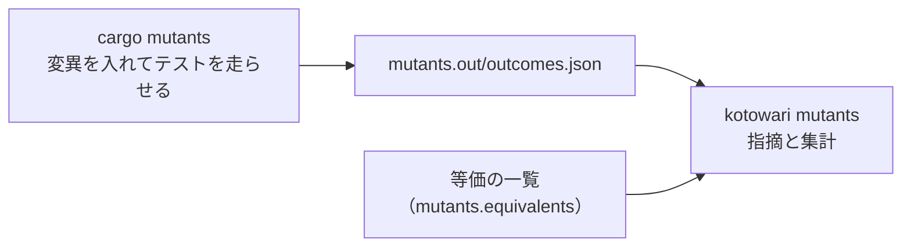

# kotowari mutants

English | [日本語](mutants.ja.md)

Reads the results file written by a mutation testing tool (currently cargo-mutants) and reports, as findings, the changes the tests did not notice (misses).
Where `kotowari check` asks "does each requirement have a test?", this command asks "do those tests actually constrain the implementation?".
Use it after a mutation test run, to judge the results.

## Synopsis

<!-- @kotowari[REQ-core-149:1ac13c99, REQ-core-002:f86e2efd, EX-core-244:e4a4c37f] -->

```sh
kotowari mutants --tool cargo-mutants [--format json|text] [--config <path>] <結果のファイル>
```

`--tool` cannot be omitted.
Options may appear before the command or after the results file (`kotowari --tool cargo-mutants mutants outcomes.json --format text` means the same thing).

## Options and arguments

<!-- @kotowari[REQ-core-149:1ac13c99, REQ-core-021:ccedd28b, REQ-core-011:0b7f52a9, REQ-core-003:8ac6759c] -->

| Name | Value | Default | Description |
|---|---|---|---|
| `<結果のファイル>` (results file) | path | none (required) | The results file the mutation testing tool wrote. Exactly one. Read as a path relative to the current directory. For cargo-mutants, this is `mutants.out/outcomes.json` |
| `--tool` | `cargo-mutants` | none (required) | The tool that wrote the results file. The only value accepted today is `cargo-mutants` |
| `--format` | `json` or `text` | `json` | The output format |
| `--config` | path | `.kotowari/config.yaml` in the base directory | The configuration file. Read as a path relative to the current directory. Used to read `mutants.equivalents` (where the list of equivalents lives) |
| `--help` / `--version` | none | | Print the usage or the version and exit |

## What it reads

<!-- @kotowari[REQ-core-147:7559338c, EX-core-210:e791ccb1] -->

Running the mutation tests happens outside kotowari.
kotowari only reads the results file once the tool has finished writing it.



It reads only these files:

- The configuration file
- The results file
- The list of equivalents (the file the configuration's `mutants.equivalents` points at)
- The source files that the mutation outcomes point at, and the files that the `file` of each entry in the list of equivalents points at

It does not read the IR, test files or decision records, and it does not run any of `check`'s checks.
It does not stop even if the paths that the configuration's `ir` or `decisions.records` point at do not exist.
As a result, misses are not tied to requirements; they are reported by source location (file and line) and the description of the change.
Tracing a miss back to a requirement is the job of the person or LLM investigating it ([When misses appear](#when-misses-appear)).

## The results file

<!-- @kotowari[TBL-core-024:17ed4a06, REQ-core-138:7c91c1d5] -->

With `--tool cargo-mutants`, kotowari reads a JSON document whose top level has an `outcomes` array.
An entry whose `scenario` is the string `"Baseline"` is the baseline run, made without any mutation, and is not counted.
Every other entry is mapped to one mutation outcome as follows.

| Field of the mutation outcome | Taken from |
|---|---|
| File | `scenario.Mutant.file` |
| Line | `scenario.Mutant.span.start.line` |
| Description of the change | `scenario.Mutant.name`, with the leading `file:line:column: ` removed |
| Outcome | `summary`: `CaughtMutant` (caught), `MissedMutant` (missed), `Timeout` (timed out), `Unviable` (unviable) |

Keys not listed here are ignored.
The detailed conditions are in [TBL-core-024](../../ir/core/mutants-input.md#TBL-core-024).

The four possible outcomes of one mutation mean the following.

| Outcome | Meaning | How kotowari treats it |
|---|---|---|
| Caught | With the mutation in, a test failed | Only counted |
| Missed | With the mutation in, all the tests still passed | Error (removed if it matches the list of equivalents) |
| Timed out | With the mutation in, the tests did not finish in time | Notice |
| Unviable | With the mutation in, the code did not build | Only counted |

## Output

### text

<!-- @kotowari[REQ-core-146:5accc94e, REQ-core-026:530a64e3, EX-core-230:c8e82733, EX-core-209:a0577005] -->

Prints one finding per line, followed by a final line with the tally.
Finding lines have the same form as in `check`: `path:line [error|notice] kind detail`.
Findings about the list of equivalents have no line, so `-` appears in the line position.

```text
.kotowari/equivalents.yaml:- [notice] equivalent_stale src/price.rs: replace - with + in discount
src/price.rs:3 [error] mutant_survived replace >= with > in total
src/price.rs:18 [notice] mutant_timeout replace += with *= in count_up
mutants: caught=4 survived=1 timeout=1 unviable=1 equivalent=1
```

The tally line has the form `mutants: caught=N survived=N timeout=N unviable=N equivalent=N` and is always printed, even when there are no findings.

### Finding kinds

<!-- @kotowari[REQ-core-139:5736cb73, REQ-core-140:49dd0d6f, REQ-core-142:3cafdd68, REQ-core-143:de58796f] -->

| Kind | Severity | path | line | detail |
|---|---|---|---|---|
| `mutant_survived` | error | The file of the mutation outcome | The line of the mutation | The description of the change |
| `mutant_timeout` | notice | The file of the mutation outcome | The line of the mutation | The description of the change |
| `equivalent_stale` | notice | The list-of-equivalents file | null | The entry's `file` and `change`, exactly as written in the list, joined by `: ` |
| `equivalent_invalid` | error | The list-of-equivalents file | null | The entry's `file` and `change`, exactly as written in the list, joined by `: ` |

The description of the change is the tool's text, unchanged.
`replace >= with > in total` means "the tests still passed after `>=` in the function `total` was replaced with `>`".
Two misses with identical content are not merged; each is reported separately.

### JSON

<!-- @kotowari[TBL-core-025:68fca5c5, PROP-core-005:80d67bc3, REQ-core-145:38dec30f] -->

The top level has exactly three keys: `findings`, `counts` and `mutants`.

| Key | Type | Description |
|---|---|---|
| `findings` | array | The list of findings. Each one has the keys `kind`, `severity`, `path`, `line` and `detail` (same as `check`) |
| `counts` | object | The number of findings per kind. A kind with no findings is omitted entirely |
| `mutants` | object | The five counts below |
| `mutants.caught` | number | Caught mutations |
| `mutants.survived` | number | Misses that match no entry in the list of equivalents (= the number of `mutant_survived`) |
| `mutants.timeout` | number | Mutations that timed out (= the number of `mutant_timeout`) |
| `mutants.unviable` | number | Unviable mutations |
| `mutants.equivalent` | number | Misses that matched the list of equivalents and were removed from the findings |

The five counts add up to the number of mutations in the results file (excluding the baseline run).
`equivalent` is "how much was removed by relying on the list".
A nonzero value is not an error, but a sudden increase is a signal to question what is in the list.

## Exit codes

<!-- @kotowari[TBL-core-002:36817bf5, REQ-core-139:5736cb73, REQ-core-140:49dd0d6f] -->

| Code | Meaning |
|---|---|
| 0 | No errors. Also 0 when there are only `mutant_timeout` or `equivalent_stale` notices |
| 1 | One or more `mutant_survived` or `equivalent_invalid` |
| 2 | Stopped (argument error, unreadable results file, results error, unreadable list of equivalents, and so on) |

On a stop, nothing is written to standard output and the reason is written on the first line of standard error.

## The list of equivalents

<!-- @kotowari[REQ-core-148:9dc7ec0a, REQ-core-143:de58796f] -->

The list of equivalents is a YAML file listing the misses you have judged to be "mutations that do not change any observable behaviour", each with its reason.
A miss that matches the list does not become a finding; it is counted under `equivalent` in the tally.

Point to it with the configuration's `mutants.equivalents`. There is no default location.

```yaml
# .kotowari/config.yaml
mutants:
  equivalents: .kotowari/equivalents.yaml
```

| State of the list | Behaviour |
|---|---|
| No key / the target is empty (0 bytes or comments only) | Continues with an empty list |
| The target does not exist or cannot be read | Stops (`unreadable file`) |
| The target is not UTF-8 | Stops (`non-UTF-8 file`) |
| Not valid YAML / the top level is not a sequence | Stops (`config error`, with the path of the list file as the detail) |

`kotowari check` checks only the shape of this key's value and does not read the file it points at.

Each entry in the list has exactly these five keys.

```yaml
- file: src/price.rs
  change: "replace > with >= in clamp_index"
  text: "if i > last { last } else { i }"
  class: equivalent
  why: >-
    i == last のときはどちらの枝も last を返すので、出力は変わらない。
    落とすテストの試み: i と len を 0..50 の全組で元と変異を突き合わせ、違いは無かった。
```

| Key | What to write |
|---|---|
| `file` | The source path (relative to the base directory; absolute paths and `..` are not allowed) |
| `change` | The description of the change. Copy the detail of `mutant_survived` as is |
| `text` | The current text of the line the mutation goes into |
| `class` | Only `equivalent` is allowed |
| `why` | The reason. Whitespace only is an error |

An entry that is missing a key, has any other key, has a non-string value, has an empty `why`, has a `class` other than `equivalent`, or has a `file` that is absolute or contains `..` is an `equivalent_invalid` error, and it removes no misses.

### How matching works

<!-- @kotowari[REQ-core-141:07d68190, EX-core-212:cf501da6, EX-core-213:4f4e6142] -->

A miss and an entry in the list match when all three of the following are the same:

1. `file` (after normalization) and the miss's file
2. `change` and the miss's description of the change
3. `text` and the current text of the source line at the miss's line number (both with leading and trailing half-width spaces and tabs removed)

Because matching uses the text of the line rather than the line number, the entry still matches if the line merely moved because lines were added above it.
If you rewrite that line itself, the match breaks and the miss appears again.
If the same file has several lines with the same text, one entry applies to any of them.

If the source file does not exist, cannot be read, is not UTF-8, or the line is beyond the end of the file, kotowari does not stop; it treats the entry as not matching (the miss is reported).

The list can remove only misses. Writing a timeout in the list does not remove it.

## Example

<!-- @kotowari[REQ-core-139:5736cb73, REQ-core-141:07d68190, REQ-core-142:3cafdd68, EX-core-206:1d66c66f] -->

This example feeds kotowari a results file for the source `src/price.rs` below, with 8 entries written by hand following the cargo-mutants format ([TBL-core-024](../../ir/core/mutants-input.md#TBL-core-024)).
cargo mutants was not run. The output is what `kotowari mutants` actually printed for this input.

```rust
pub fn total(price: u32, qty: u32) -> u32 {
    let subtotal = price * qty;
    if subtotal >= 10000 {
        subtotal - 500
    } else {
        subtotal
    }
}

pub fn clamp_index(i: usize, len: usize) -> usize {
    let last = len.saturating_sub(1);
    if i > last { last } else { i }
}

pub fn count_up(n: u32) -> u32 {
    let mut i = 0;
    while i < n {
        i += 1;
    }
    i
}
```

One entry of the results file looks like this (an excerpt of `outcomes.json`).

```json
{
  "scenario": {
    "Mutant": {
      "file": "src/price.rs",
      "span": { "start": { "line": 3, "column": 17 }, "end": { "line": 3, "column": 19 } },
      "name": "src/price.rs:3:17: replace >= with > in total"
    }
  },
  "summary": "MissedMutant"
}
```

The configuration is `mutants.equivalents: .kotowari/equivalents.yaml`, and the list holds the `clamp_index` entry from [The list of equivalents](#the-list-of-equivalents) plus one entry pointing at a line of `discount`, a function that no longer exists (`text: "price - price / 10"`).

```console
$ kotowari mutants --tool cargo-mutants --format text outcomes.json
.kotowari/equivalents.yaml:- [notice] equivalent_stale src/price.rs: replace - with + in discount
src/price.rs:3 [error] mutant_survived replace >= with > in total
src/price.rs:18 [notice] mutant_timeout replace += with *= in count_up
mutants: caught=4 survived=1 timeout=1 unviable=1 equivalent=1
$ echo $?
1
```

- The miss from replacing `>=` with `>` in `total` is not in the list, so it is an error. Without a test that checks the case where `subtotal` is exactly 10000, a miss of this kind remains
- The miss on line 12 of `clamp_index` matched an entry in the list, so it is not a finding and is counted in `equivalent=1`
- The timeout in `count_up` is a notice
- The `discount` entry's `text` appears nowhere in the source, so it becomes an `equivalent_stale` notice

The tally is 4+1+1+1+1 = 8, matching the number of mutations created.

Here is the JSON for the same input.

```console
$ kotowari mutants --tool cargo-mutants outcomes.json
{"findings":[{"kind":"equivalent_stale","severity":"notice","path":".kotowari/equivalents.yaml","line":null,"detail":"src/price.rs: replace - with + in discount"},{"kind":"mutant_survived","severity":"error","path":"src/price.rs","line":3,"detail":"replace >= with > in total"},{"kind":"mutant_timeout","severity":"notice","path":"src/price.rs","line":18,"detail":"replace += with *= in count_up"}],"counts":{"equivalent_stale":1,"mutant_survived":1,"mutant_timeout":1},"mutants":{"caught":4,"survived":1,"timeout":1,"unviable":1,"equivalent":1}}
```

## When misses appear

Sort each miss into one of the following three classes.
This is not a kotowari feature; it is the procedure for whoever investigates the misses.

| Class | Meaning | What to do next |
|---|---|---|
| Untested | The behaviour changes, but no test looks at it | First check whether the requirement is specific enough to tell that mutation apart. If it is vague, fix the IR; if it is specific, add a test marked with that requirement or example |
| Suspected defect | The original code is what is wrong | Fix the code |
| Equivalent | The mutation does not change any observable behaviour | Follow the steps below |

If you add a test first for an untested miss, you lock a vague requirement into "whatever the current implementation does".
This is the stage where a miss gets tied back to a requirement.

When you think a miss is equivalent, do not add it to the list right away; go through these steps in order:

1. See whether simplifying the code can make the mutation itself go away (remove unreachable branches or unused values)
2. Ask an LLM in a separate context to write a test that fails with that mutation. If it can, adopt that test (it was not equivalent after all)
3. If it cannot, write in `why` what was tried that failed to catch it, and add one entry to the list of equivalents

## Common pitfalls

### `argument error: mutants requires the option: --tool`

<!-- @kotowari[REQ-core-149:1ac13c99, EX-core-218:a0656f36, EX-core-240:3f1d22d5] -->

You forgot `--tool`.
The format of the results file differs from tool to tool, so there is no default.
Any value other than `cargo-mutants` is also an argument error.

```console
$ kotowari mutants --format text outcomes.json
argument error: mutants requires the option: --tool
$ kotowari mutants --tool stryker outcomes.json
argument error: unknown tool: stryker
```

### `results error: ...`

<!-- @kotowari[REQ-core-144:ad1689f2, EX-core-207:34357194, EX-core-208:e5d0458a] -->

The results file is in a form kotowari cannot read.
It stops if any of the following holds: the JSON is broken, a required key is missing or has the wrong type, there is an unknown `summary` value, the baseline run failed, a line is less than 1, the prefix of `name` does not fit the expected form, or a file path is absolute or contains `..` (the full set of conditions is in [REQ-core-144](../../ir/core/mutants-input.md#REQ-core-144)).
A results file with no baseline run at all does not stop it.

```console
$ kotowari mutants --tool cargo-mutants --format text broken-baseline.json
results error: broken-baseline.json: the baseline run did not succeed: Failure
$ kotowari mutants --tool cargo-mutants --format text unknown-summary.json
results error: unknown-summary.json: unknown outcome: Flaky
```

If the baseline run failed, the tests were already failing before any mutation went in.
Get the tests passing first, then run the mutation tests again.

### `equivalent_invalid` appears and misses that were removed come back

<!-- @kotowari[REQ-core-143:de58796f, EX-core-215:60ee255d] -->

An entry in the list is malformed, and that entry removes no misses.
Here is the output when the `why` of the `clamp_index` entry in the example list above is set to `" "`.

```console
$ kotowari mutants --tool cargo-mutants --format text outcomes.json
.kotowari/equivalents.yaml:- [error] equivalent_invalid src/price.rs: replace > with >= in clamp_index
.kotowari/equivalents.yaml:- [notice] equivalent_stale src/price.rs: replace - with + in discount
src/price.rs:3 [error] mutant_survived replace >= with > in total
src/price.rs:12 [error] mutant_survived replace > with >= in clamp_index
src/price.rs:18 [notice] mutant_timeout replace += with *= in count_up
mutants: caught=4 survived=2 timeout=1 unviable=1 equivalent=0
```

Use the `file: change` in the detail to tell which entry it is.

### `equivalent_stale` appears

<!-- @kotowari[REQ-core-142:3cafdd68, EX-core-213:4f4e6142] -->

No line in `file` has the same text as the entry's `text` any more.
This happens when you rewrite the code or delete the whole function.
If the mutation is still reported as a miss, redo the judgement; if it no longer appears, remove the entry from the list.
kotowari does not look at whether the mutation appears in the results file, so even results from a run over only the diff will not wrongly call an entry stale.

### A timeout does not go away even though it is in the list of equivalents

<!-- @kotowari[REQ-core-140:49dd0d6f, EX-core-206:1d66c66f] -->

This is as specified.
The list can remove only misses; timeouts are never matched against the list.
A timeout is a notice, so it does not change the exit code.

### It stops because the path to the list of equivalents does not exist

<!-- @kotowari[REQ-core-148:9dc7ec0a, EX-core-217:41f2375e, EX-core-239:069fe928] -->

If the file that the configuration's `mutants.equivalents` points at does not exist, kotowari stops with `unreadable file`.
If you do not use a list, remove the key entirely or put an empty file there.
If the content is not a sequence (it does not start with `- file: ...`), the path of the list file appears after `config error:`.

## Related

- Specification: [Findings and tally](../../ir/core/mutants.md), [Reading the results file](../../ir/core/mutants-input.md), [The list of equivalents](../../ir/core/equivalents.md), [Arguments](../../ir/core/cli.md#REQ-core-149)
- Common format and stops: [cli.md](../cli.md)
- The configuration key `mutants.equivalents`: [config.md](../config.md)
- The list of finding kinds: [findings.md](../findings.md)
- Checking whether requirements have tests: [kotowari check](check.md)
- An example that runs everything from execution to judgement in one go: this repository's [scripts/mutants.sh](../../../scripts/mutants.sh)
