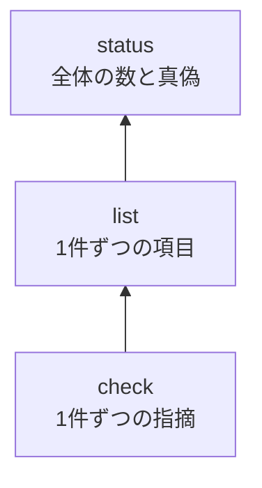

# kotowari status

[English](status.md) | 日本語

<!-- @kotowari[REQ-core-162:896047ff] -->

`kotowari status` は、IR（仕様）とテストが「いま揃っているか」を、数と一つの真偽で答えるコマンドです。
CI に一行足すだけで、仕様の抜けやテストの無い要求が紛れ込んだ変更を止められます。

## 3 つの読み取りコマンドの中での位置

<!-- @kotowari[REQ-core-162:896047ff] -->

kotowari には、IR を読む道具が段になって並んでいます。



- 何が悪いのかを直すときは [`check`](./check.ja.md)
- どの要求にどのテストが付いているかを見るときは [`list`](./list.ja.md)
- 全体として出してよい状態かを知りたいときは `status`

`status` は独自の判定を持たず、`check` と同じ設定・同じ検査の結果を集計しているだけです。
そのため `check` と `status` の答えが食い違うことはありません。

## 書式

<!-- @kotowari[REQ-core-002:f86e2efd, REQ-core-004:2d3401d1] -->

```sh
kotowari status [--format json|text] [--config <path>]
kotowari status --help
kotowari status --version
```

オプションはコマンドの前にも後ろにも書けます。
位置引数は受けません。

## オプションと引数

<!-- @kotowari[REQ-core-166:68151ef8, REQ-core-003:b4f59e48, REQ-core-011:0b7f52a9] -->

| 名前 | 値 | 既定 | 説明 |
|---|---|---|---|
| `--format` | `json` か `text` | `json` | 出力の形 |
| `--config` | 設定ファイルのパス | 基準のディレクトリの `.kotowari/config.yaml` | 読む設定ファイル。パスはカレントディレクトリからの相対で読みます |
| `--help` | なし | — | 使い方を出して終わります |
| `--version` | なし | — | 版を出して終わります |

共通のオプションと基準のディレクトリの詳細は [CLI の共通事項](../cli.ja.md) にあります。

## 出力

`status` は `check` と同じ設定と置き場から、IR の文書、テストのファイル、ガイド、全体像の元データを読み、`surface.rules` が空の一覧でなければ面のファイルと面の規則のファイルと未記載の面の一覧も読んで、`check` と同じ検査を行います。
指摘そのものは出さず、数と `complete` だけを出します。

### text

<!-- @kotowari[REQ-core-166:68151ef8, EX-core-261:249bdc79] -->

1つの群を1行にして、`群名 鍵=値 鍵=値 …` の形で出します。
鍵の語は JSON と同じで、値は1つの半角空白で区切り、桁揃えはしません。
群の順は下の表の順で、最後の行は `complete true` か `complete false` です。

`tests` の行だけは、JSON の `files` を開いて `拡張子=ファイルの数` を並べます（例: `tests marks=2042 rs=55`）。

### JSON

<!-- @kotowari[TBL-core-028:9645c008, REQ-core-164:c48d77e2, EX-core-398:4b7f4c92] -->

最上位は次の群の鍵だけのオブジェクトで、`complete` が最後です。
全部の鍵の定義は [status の IR](../../ir/core/status.ja.md) の TBL-core-028 にあります。

| 群 | 鍵 | 型 | 説明 |
|---|---|---|---|
| `documents` | `files`、`lines` | 数 | 読んだ IR の文書の数と、行数の合計 |
| `items` | `requirement`、`table`、`property`、`scenario`、`flag` | 数 | ID を持つ項目とシナリオの、種類ごとの数 |
| `requirements` | `unit`、`property`、`proof`、`review` | 数 | `- verification:` の値ごとの要求の数。行の無い要求はどれにも数えない |
| `requirements` | `with_tests`、`without_tests` | 数 | 検証が review でなく[後回し](../deferred.ja.md)でない要求のうち、テストがあるものと無いものの数 |
| `requirements` | `review_with_how_to_verify`、`review_without_how_to_verify` | 数 | 検証が review の要求のうち、`- how_to_verify:` の行があるものと無いものの数 |
| `requirements` | `without_examples` | 数 | その ID を `@about` に持つシナリオが無い要求の数。後回しの要求も数える |
| `requirements` | `deferred` | 数 | 後回しの要求の数 |
| `scenarios` | `with_tests`、`without_tests` | 数 | 後回しのシナリオでないシナリオのうち、印の付いたテストがあるものと無いものの数 |
| `scenarios` | `deferred` | 数 | 後回しのシナリオの数 |
| `tests` | `marks` | 数 | 印の出現の数。1つの印に ID が複数あれば ID ごとに1つ |
| `tests` | `files` | オブジェクト | `check` の JSON の `tests` と同じ。鍵は拡張子、値は `files`（ファイルの数）と `query`（問い合わせのある言語か） |
| `guides` | `files`、`marks` | 数 | 読んだガイドの数と、ガイドの印の数（`check` の `guides` と同じ） |
| `overview` | `files`、`marks` | 数 | 読んだ全体像の元データの数と、その中のガイドの印の数（`check` の `overview` と同じ）。設定に `overview` の鍵が無ければ両方 0 |
| `surface` | `total`、`specified`、`unspecified` | 数 | 面の種類と名前の組の数、そのうち IR にあるものの数、IR になく未記載の面の一覧で外したものの数（[面の検査](../surface.ja.md)）。`surface.rules` が空の一覧なら3つとも 0 |
| `findings` | `error`、`notice` | 数 | `check` の誤りと注意の数 |
| `complete` | （値だけ） | 真偽 | 揃っているか。条件は次の節 |

### よく見る数

<!-- @kotowari[TBL-core-028:9645c008] -->

特によく見る数だけ挙げます。

| 行 | 見るところ | こういうときに気にする |
|---|---|---|
| `requirements` | `without_tests` | 0 でなければ、テストが一つも付いていない要求がある |
| `requirements` | `review_without_how_to_verify` | 0 でなければ、人か LLM が目で確かめる要求なのに、確かめ方が書かれていない |
| `requirements` | `without_examples` | 具体例（シナリオ）の無い要求の数。欠陥ではないが、仕様が薄い所の目安になる |
| `requirements`、`scenarios` | `deferred` | 今は作らないと宣言した要求とシナリオの数。`without_tests` には入らないので、増えても `complete` は変わらない |
| `items` | `flag` | 「仕様として書ききれていない」と自分で記録した箇所の数 |
| `guides` | `files` / `marks` | 読んだガイドの数と、ガイドの印の数。設定の glob を書き間違えると 0 になる |
| `surface` | `unspecified` | IR に書かないまま未記載の面の一覧で外している面の数。導入の残りの量の目安で、0 に近づけていく |
| `findings` | `error` / `notice` | `check` の指摘の数。`notice` は注意で、揃っているかの判定には効かない |

### `complete` が true になる条件

<!-- @kotowari[REQ-core-165:1c91b003, EX-core-259:6583a1e7, EX-core-260:73c20b9a] -->

`complete` が true になるのは、次の 2 つが両方成り立つときだけです。

1. `check` の誤り（`error`）が 0 件
2. 問題の記録（`FLAGS.md`）の項目が 0 件

注意（`notice`）がいくつあっても、`complete` は妨げません。
注意は直す価値のある手がかりですが、出荷を止める理由にはしない、という区別です。

## 終了コード

<!-- @kotowari[REQ-core-165:1c91b003, REQ-core-163:9cf2f990, EX-core-262:c1a7983a] -->

終了コードは `complete` の答えをそのまま映します。

| コード | 意味 |
|---|---|
| 0 | 揃っている（`complete true`）。`--help` か `--version` で終わったときも 0 |
| 1 | 揃っていない（`complete false`） |
| 2 | 停止した（設定が読めないなど、集計できなかった。理由は標準エラーに出ます） |

停止の理由と文言は `check` と同じです（[CLI の共通事項](../cli.ja.md)）。

## 例

### 使ってみる

<!-- @kotowari[REQ-core-166:68151ef8, EX-core-261:249bdc79] -->

リポジトリの根で実行します。
人が読むなら `--format text` が便利です。

```console
$ kotowari status --format text
documents files=52 lines=6238
items requirement=305 table=48 property=13 scenario=374 flag=0
requirements unit=260 property=3 proof=0 review=42 with_tests=263 without_tests=0 review_with_how_to_verify=42 review_without_how_to_verify=0 without_examples=138 deferred=0
scenarios with_tests=367 without_tests=7 deferred=0
tests marks=2152 rs=58
guides files=14 marks=525
surface total=11 specified=11 unspecified=0
findings error=0 notice=8
complete true
```

これは kotowari 自身のリポジトリで 2026-09-27 に実行した結果です。
全体像の元データを読む今の版では、`guides` の行の後に `overview files=… marks=…` の行も出ます（設定に `overview` の鍵が無ければ両方 0）。
最後の `complete true` が答えで、それより上の行はその内訳です。
`notice` があっても `complete true` になっている点に注目してください。

既定の出力は JSON で、鍵の名前は text と同じです。
スクリプトやエージェントに読ませるときはこちらを使います。

```console
$ kotowari status | jq .complete
true
```

### CI で使う

<!-- @kotowari[REQ-core-165:1c91b003] -->

終了コードが判定そのものなので、ジョブの一段として置くだけで足ります。

```yaml
# GitHub Actions の例（kotowari の導入手順は省略）
- name: 仕様が揃っているか
  run: kotowari status --format text
```

揃っていなければジョブが落ち、ログにはどの数が崩れたかが残ります。
詳しい理由は、同じ手元で `kotowari check --format text` を実行すると 1 件ずつ出ます。

## よくあるつまずき

### `without_tests` が 0 でない

<!-- @kotowari[TBL-core-028:9645c008, TBL-core-026:382b0b95, EX-core-263:f86b1e4a] -->

テストに印（`@kotowari[REQ-...]`）が付いていない要求があります。
`kotowari list --format text | grep 'tests=0$'` で、印の付いたテストが無い項目を探せます。
後回しの項目は行の末尾が ` deferred` なので、この grep には当たりません。
ただし要求は、直接印が無くても、その要求を `@about` に持つシナリオにテストが付いていれば「テストあり」に数えられます。
一覧で `tests=0` の要求を見つけたら、そのシナリオ側も確かめてください。
今は作らないと決めた要求なら、テストの代わりに[後回し](../deferred.ja.md)にすると `without_tests` から外れます。

### `review_without_how_to_verify` が 0 でない

<!-- @kotowari[REQ-core-098:1e550dfe, EX-core-259:6583a1e7] -->

テストでは確かめられない要求（`verification: review`）に、`- how_to_verify:` の行がありません。
手順が無いと、人でも LLM でも確かめようがないため、`check` はこれを誤りにします。

### `flag` が 0 でない

<!-- @kotowari[REQ-core-165:1c91b003, EX-core-260:73c20b9a] -->

`FLAGS.md` に書かれた未解決の箇所が残っています。
仕様を書き足して記録を消すまで、`complete` にはなりません。

### `unit`、`property`、`proof`、`review` の合計が `requirement` より少ない

<!-- @kotowari[TBL-core-028:9645c008] -->

`- verification:` の行の無い要求があります。そうした要求は検証の種類ごとの数のどれにも入りません。
この要求は `check` の誤りでもあるので、`complete` は false になります。
`kotowari check --format text` で場所が分かります。

### `config error: ...: matched by both guides.files and tests.files` で止まる

<!-- @kotowari[REQ-core-163:9cf2f990, REQ-core-199:55922b15] -->

`status` は `check` と同じくガイドも読むので、設定の `guides.files` と `tests.files` の glob が同じファイルに当たると停止します。
`list` と `query` はガイドを読まないのでこの停止をしません。そのため「list は動くのに status は止まる」ことがあります。
2つの glob が重ならないように直してください（[設定](../config.ja.md)）。

## 関連

- 仕様: [status の IR](../../ir/core/status.ja.md)
- 1 件ずつの指摘を見る: [`kotowari check`](./check.ja.md)
- 1 件ずつの項目とテストを見る: [`kotowari list`](./list.ja.md)
- 1 件を本文と逆引きつきで見る: [`kotowari query`](./query.ja.md)
- 指摘の種類: [指摘の一覧](../findings.ja.md)
- 共通のオプション、停止、基準のディレクトリ: [CLI の共通事項](../cli.ja.md)
- 設定ファイル: [設定](../config.ja.md)

`complete` は今回の Git 差分の照合を保証しません。取り込み前は check と、比較元からブランチ全体の `changes --phase review` を両方成功させます。
