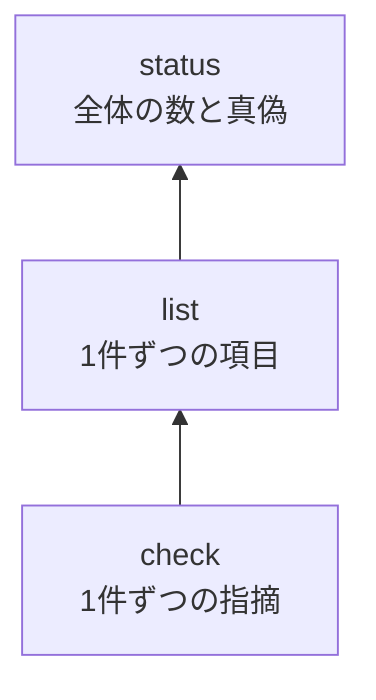

# kotowari status

English | [日本語](status.ja.md)

<!-- @kotowari[REQ-core-162:896047ff] -->

`kotowari status` answers whether the IR (the specification) and the tests are "in place right now", with counts and a single true/false.
Add one line to your CI, and it stops changes that slip in specification gaps or requirements without tests.

## Where it sits among the three read commands

<!-- @kotowari[REQ-core-162:896047ff] -->

kotowari's tools for reading the IR are arranged in tiers.



- To fix what is wrong, use [`check`](./check.md)
- To see which tests are attached to which requirements, use [`list`](./list.md)
- To know whether the whole is in a shippable state, use `status`

`status` has no judgment of its own; it only aggregates the results of the same configuration and the same checks as `check`.
So `check` and `status` never disagree.

## Synopsis

<!-- @kotowari[REQ-core-002:f86e2efd, REQ-core-004:7719a0bd] -->

```sh
kotowari status [--format json|text] [--config <path>]
kotowari status --help
kotowari status --version
```

Options may come before or after the command.
It takes no positional arguments.

## Options and arguments

<!-- @kotowari[REQ-core-166:68151ef8, REQ-core-003:8ac6759c, REQ-core-011:0b7f52a9] -->

| Name | Value | Default | Description |
|---|---|---|---|
| `--format` | `json` or `text` | `json` | The output form |
| `--config` | Path to a configuration file | `.kotowari/config.yaml` in the base directory | The configuration file to read. The path is read relative to the current directory |
| `--help` | none | — | Prints usage and exits |
| `--version` | none | — | Prints the version and exits |

Details of the common options and the base directory are in [CLI basics](../cli.md).

## Output

From the same configuration and locations as `check`, `status` reads the IR documents, test files, guides and overview data, and — when `surface.rules` is not an empty list — the surface files, the surface rule files and the list of unspecified surfaces, then runs the same checks as `check`.
It does not print the findings themselves, only counts and `complete`.

### text

<!-- @kotowari[REQ-core-166:68151ef8, EX-core-261:249bdc79] -->

Each group is printed on one line in the form `group key=value key=value …`.
The key words are the same as in JSON; values are separated by single spaces with no column alignment.
Groups come in the order of the table below, and the last line is `complete true` or `complete false`.

Only the `tests` line expands JSON's `files` into `extension=number-of-files` pairs (for example, `tests marks=2042 rs=55`).

### JSON

<!-- @kotowari[TBL-core-028:9645c008, REQ-core-164:c48d77e2, EX-core-398:4b7f4c92] -->

The top level is an object with only the following group keys, with `complete` last.
All keys are defined in TBL-core-028 of the [status IR](../../ir/core/status.md).

| Group | Keys | Type | Description |
|---|---|---|---|
| `documents` | `files`, `lines` | number | The number of IR documents read, and their total line count |
| `items` | `requirement`, `table`, `property`, `scenario`, `flag` | number | The number of items and scenarios with IDs, per kind |
| `requirements` | `unit`, `property`, `proof`, `review` | number | The number of requirements per `- verification:` value. Requirements without the line are not counted in any of them |
| `requirements` | `with_tests`, `without_tests` | number | Among requirements whose verification is not review and that are not [deferred](../deferred.md), the number with tests and without |
| `requirements` | `review_with_how_to_verify`, `review_without_how_to_verify` | number | Among requirements whose verification is review, the number with a `- how_to_verify:` line and without |
| `requirements` | `without_examples` | number | The number of requirements with no scenario naming their ID in `@about`. Deferred requirements are counted too |
| `requirements` | `deferred` | number | The number of deferred requirements |
| `scenarios` | `with_tests`, `without_tests` | number | Among scenarios that are not deferred scenarios, the number with a marked test and without |
| `scenarios` | `deferred` | number | The number of deferred scenarios |
| `tests` | `marks` | number | The number of mark occurrences. A mark with several IDs counts once per ID |
| `tests` | `files` | object | The same as `tests` in the JSON of `check`. Keys are extensions; values are `files` (the number of files) and `query` (whether it is a language with a query) |
| `guides` | `files`, `marks` | number | The number of guides read and the number of guide marks (the same as `guides` in `check`) |
| `overview` | `files`, `marks` | number | The number of overview data files read and the number of guide marks in them (the same as `overview` in `check`). Both are 0 if the configuration has no `overview` key |
| `surface` | `total`, `specified`, `unspecified` | number | The number of surface kind-and-name pairs, how many of them are in the IR, and how many are not in the IR but excluded by the list of unspecified surfaces ([Surface checks](../surface.md)). All three are 0 if `surface.rules` is an empty list |
| `findings` | `error`, `notice` | number | The number of errors and notices from `check` |
| `complete` | (value only) | boolean | Whether everything is in place. The conditions are in the next section |

### Numbers to watch

<!-- @kotowari[TBL-core-028:9645c008] -->

Here are just the numbers you will look at most often.

| Line | Where to look | When to worry |
|---|---|---|
| `requirements` | `without_tests` | If not 0, some requirement has no test attached at all |
| `requirements` | `review_without_how_to_verify` | If not 0, a requirement meant to be checked by a person or an LLM has no description of how to check it |
| `requirements` | `without_examples` | The number of requirements without concrete examples (scenarios). Not a defect, but a hint at where the specification is thin |
| `requirements`, `scenarios` | `deferred` | The number of requirements and scenarios declared as not being built for now. They are not included in `without_tests`, so `complete` does not change as they grow |
| `items` | `flag` | The number of places you yourself recorded as "not fully written as a specification" |
| `guides` | `files` / `marks` | The number of guides read and the number of guide marks. A mistyped glob in the configuration makes these 0 |
| `surface` | `unspecified` | The number of surfaces excluded by the list of unspecified surfaces without being written in the IR. A measure of how much adoption work remains; bring it toward 0 |
| `findings` | `error` / `notice` | The number of findings from `check`. `notice` means notices, which do not affect whether everything is in place |

### When `complete` is true

<!-- @kotowari[REQ-core-165:1c91b003, EX-core-259:6583a1e7, EX-core-260:73c20b9a] -->

`complete` is true only when both of the following hold.

1. `check` has 0 errors (`error`)
2. The flag records (`FLAGS.md`) have 0 items

No matter how many notices (`notice`) there are, they do not prevent `complete`.
The distinction is that notices are clues worth fixing, but not a reason to hold back a release.

## Exit codes

<!-- @kotowari[REQ-core-165:1c91b003, REQ-core-163:9cf2f990, EX-core-262:c1a7983a] -->

The exit code mirrors the `complete` answer directly.

| Code | Meaning |
|---|---|
| 0 | In place (`complete true`). Also 0 when it exits via `--help` or `--version` |
| 1 | Not in place (`complete false`) |
| 2 | Stopped (it could not aggregate, for example because the configuration could not be read. The reason goes to standard error) |

The reasons and messages for stopping are the same as for `check` ([CLI basics](../cli.md)).

## Examples

### Trying it out

<!-- @kotowari[REQ-core-166:68151ef8, EX-core-261:249bdc79] -->

Run it at the repository root.
For reading it yourself, `--format text` is handy.

```console
$ kotowari status --format text
documents files=52 lines=6238
items requirement=305 table=48 property=13 scenario=374 flag=0
requirements unit=260 property=3 proof=0 review=42 with_tests=263 without_tests=0 review_with_how_to_verify=42 review_without_how_to_verify=0 without_examples=138 deferred=0
scenarios with_tests=367 without_tests=7 deferred=0
tests marks=2152 rs=58
guides files=14 marks=525
surface total=11 specified=11 unspecified=0
findings error=0 notice=8
complete true
```

This is the result of running it on kotowari's own repository on 2026-09-27.
In the current version, which reads overview data, an `overview files=… marks=…` line also appears after the `guides` line (both 0 if the configuration has no `overview` key).
The final `complete true` is the answer; the lines above it are its breakdown.
Note that `complete` is true even though there are notices.

The default output is JSON, with the same key names as text.
Use it when a script or an agent reads the output.

```console
$ kotowari status | jq .complete
true
```

### Using it in CI

<!-- @kotowari[REQ-core-165:1c91b003] -->

The exit code is the verdict itself, so adding it as one step of a job is all you need.

```yaml
# GitHub Actions の例（kotowari の導入手順は省略）
- name: 仕様が揃っているか
  run: kotowari status --format text
```

If things are not in place, the job fails, and the log shows which numbers went wrong.
For the detailed reasons, run `kotowari check --format text` in the same checkout to see them one by one.

## Common pitfalls

### `without_tests` is not 0

<!-- @kotowari[TBL-core-028:9645c008, TBL-core-026:382b0b95, EX-core-263:f86b1e4a] -->

Some requirements have no marks (`@kotowari[REQ-...]`) on their tests.
`kotowari list --format text | grep 'tests=0$'` finds items with no marked tests.
Deferred items end their line with ` deferred`, so this grep does not match them.
Note, however, that a requirement counts as "having tests" even without a direct mark if a scenario naming it in `@about` has a test.
When you find a requirement with `tests=0` in the list, also check its scenarios.
If you decided not to build the requirement for now, making it [deferred](../deferred.md) instead of adding a test removes it from `without_tests`.

### `review_without_how_to_verify` is not 0

<!-- @kotowari[REQ-core-098:1e550dfe, EX-core-259:6583a1e7] -->

A requirement that cannot be checked by tests (`verification: review`) has no `- how_to_verify:` line.
Without a procedure, neither a person nor an LLM can check it, so `check` treats this as an error.

### `flag` is not 0

<!-- @kotowari[REQ-core-165:1c91b003, EX-core-260:73c20b9a] -->

Unresolved points written in `FLAGS.md` remain.
`complete` will not be true until you fill in the specification and remove the record.

### The sum of `unit`, `property`, `proof` and `review` is less than `requirement`

<!-- @kotowari[TBL-core-028:9645c008] -->

Some requirements have no `- verification:` line. Such requirements are not counted in any per-verification count.
This is also an error in `check`, so `complete` is false.
`kotowari check --format text` shows where they are.

### Stopping with `config error: ...: matched by both guides.files and tests.files`

<!-- @kotowari[REQ-core-163:9cf2f990, REQ-core-199:55922b15] -->

Like `check`, `status` also reads guides, so it stops when the `guides.files` and `tests.files` globs in the configuration match the same file.
`list` and `query` do not read guides and do not stop this way, which is why you may see "list works but status stops".
Fix the two globs so they do not overlap ([Configuration](../config.md)).

## Related

- Specification: [status IR](../../ir/core/status.md)
- Seeing findings one by one: [`kotowari check`](./check.md)
- Seeing items and tests one by one: [`kotowari list`](./list.md)
- Seeing one item with its body and reverse references: [`kotowari query`](./query.md)
- Kinds of findings: [Findings](../findings.md)
- Common options, stopping and the base directory: [CLI basics](../cli.md)
- Configuration file: [Configuration](../config.md)
