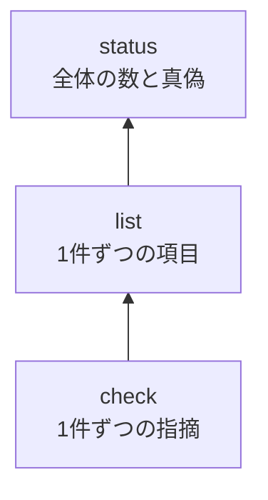

# kotowari status

<!-- @kotowari[REQ-core-162:3010211a] -->

`kotowari status` は、IR（仕様）とテストが「いま揃っているか」を、数と一つの真偽で答えるコマンドです。
CI に一行足すだけで、仕様の抜けやテストの無い要求が紛れ込んだ変更を止められます。

## 3 つの読み取りコマンドの中での位置

<!-- @kotowari[REQ-core-162:3010211a] -->

kotowari には、IR を読む道具が段になって並んでいます。



- 何が悪いのかを直すときは [`check`](./check.md)
- どの要求にどのテストが付いているかを見るときは [`list`](./list.md)
- 全体として出してよい状態かを知りたいときは `status`

`status` は独自の判定を持たず、`check` と同じ設定・同じ検査の結果を集計しているだけです。
そのため `check` と `status` の答えが食い違うことはありません。

## 書式

<!-- @kotowari[REQ-core-002:da12d397, REQ-core-004:e34832b6] -->

```sh
kotowari status [--format json|text] [--config <path>]
kotowari status --help
kotowari status --version
```

オプションはコマンドの前にも後ろにも書けます。
位置引数は受けません。

## オプションと引数

<!-- @kotowari[REQ-core-166:5789e852, REQ-core-003:ccf703c7, REQ-core-011:549c5c91] -->

| 名前 | 値 | 既定 | 説明 |
|---|---|---|---|
| `--format` | `json` か `text` | `json` | 出力の形 |
| `--config` | 設定ファイルのパス | 基準のディレクトリの `.kotowari/config.yaml` | 読む設定ファイル。パスはカレントディレクトリからの相対で読みます |
| `--help` | なし | — | 使い方を出して終わります |
| `--version` | なし | — | 版を出して終わります |

共通のオプションと基準のディレクトリの詳細は [CLI の共通事項](../cli.md) にあります。

## 出力

`status` は `check` と同じ設定と置き場から、IR の文書、テストのファイル、ガイドを読み、`check` と同じ検査を行います。
指摘そのものは出さず、数と `complete` だけを出します。

### text

<!-- @kotowari[REQ-core-166:5789e852, EX-core-261:780aa92a] -->

1つの群を1行にして、`群名 鍵=値 鍵=値 …` の形で出します。
鍵の語は JSON と同じで、値は1つの半角空白で区切り、桁揃えはしません。
群の順は下の表の順で、最後の行は `complete true` か `complete false` です。

`tests` の行だけは、JSON の `files` を開いて `拡張子=ファイルの数` を並べます（例: `tests marks=1945 rs=51`）。

### JSON

<!-- @kotowari[TBL-core-028:e870328f, REQ-core-164:c48d77e2] -->

最上位は次の群の鍵だけのオブジェクトで、`complete` が最後です。
全部の鍵の定義は [status の IR](../../ir/core/status.md) の TBL-core-028 にあります。

| 群 | 鍵 | 型 | 説明 |
|---|---|---|---|
| `documents` | `files`、`lines` | 数 | 読んだ IR の文書の数と、行数の合計 |
| `items` | `requirement`、`table`、`property`、`scenario`、`flag` | 数 | ID を持つ項目とシナリオの、種類ごとの数 |
| `requirements` | `unit`、`property`、`proof`、`review` | 数 | `- verification:` の値ごとの要求の数。行の無い要求はどれにも数えない |
| `requirements` | `with_tests`、`without_tests` | 数 | 検証が review でない要求のうち、テストがあるものと無いものの数 |
| `requirements` | `review_with_how_to_verify`、`review_without_how_to_verify` | 数 | 検証が review の要求のうち、`- how_to_verify:` の行があるものと無いものの数 |
| `requirements` | `without_examples` | 数 | その ID を `@about` に持つシナリオが無い要求の数 |
| `scenarios` | `with_tests`、`without_tests` | 数 | 印の付いたテストがあるシナリオと無いシナリオの数 |
| `tests` | `marks` | 数 | 印の出現の数。1つの印に ID が複数あれば ID ごとに1つ |
| `tests` | `files` | オブジェクト | `check` の JSON の `tests` と同じ。鍵は拡張子、値は `files`（ファイルの数）と `query`（問い合わせのある言語か） |
| `guides` | `files`、`marks` | 数 | 読んだガイドの数と、ガイドの印の数（`check` の `guides` と同じ） |
| `findings` | `error`、`notice` | 数 | `check` の誤りと注意の数 |
| `complete` | （値だけ） | 真偽 | 揃っているか。条件は次の節 |

### よく見る数

<!-- @kotowari[TBL-core-028:e870328f] -->

特によく見る数だけ挙げます。

| 行 | 見るところ | こういうときに気にする |
|---|---|---|
| `requirements` | `without_tests` | 0 でなければ、テストが一つも付いていない要求がある |
| `requirements` | `review_without_how_to_verify` | 0 でなければ、人か LLM が目で確かめる要求なのに、確かめ方が書かれていない |
| `requirements` | `without_examples` | 具体例（シナリオ）の無い要求の数。欠陥ではないが、仕様が薄い所の目安になる |
| `items` | `flag` | 「仕様として書ききれていない」と自分で記録した箇所の数 |
| `guides` | `files` / `marks` | 読んだガイドの数と、ガイドの印の数。設定の glob を書き間違えると 0 になる |
| `findings` | `error` / `notice` | `check` の指摘の数。`notice` は注意で、揃っているかの判定には効かない |

### `complete` が true になる条件

<!-- @kotowari[REQ-core-165:04b69a41, EX-core-259:f70360a4, EX-core-260:f146f36c] -->

`complete` が true になるのは、次の 2 つが両方成り立つときだけです。

1. `check` の誤り（`error`）が 0 件
2. 問題の記録（`FLAGS.md`）の項目が 0 件

注意（`notice`）がいくつあっても、`complete` は妨げません。
注意は直す価値のある手がかりですが、出荷を止める理由にはしない、という区別です。

## 終了コード

<!-- @kotowari[REQ-core-165:04b69a41, REQ-core-163:b640be93, EX-core-262:547c3880] -->

終了コードは `complete` の答えをそのまま映します。

| コード | 意味 |
|---|---|
| 0 | 揃っている（`complete true`）。`--help` か `--version` で終わったときも 0 |
| 1 | 揃っていない（`complete false`） |
| 2 | 停止した（設定が読めないなど、集計できなかった。理由は標準エラーに出ます） |

停止の理由と文言は `check` と同じです（[CLI の共通事項](../cli.md)）。

## 例

### 使ってみる

<!-- @kotowari[REQ-core-166:5789e852, EX-core-261:780aa92a] -->

リポジトリの根で実行します。
人が読むなら `--format text` が便利です。

```console
$ kotowari status --format text
documents files=47 lines=5545
items requirement=272 table=47 property=13 scenario=320 flag=0
requirements unit=242 property=3 proof=0 review=27 with_tests=245 without_tests=0 review_with_how_to_verify=27 review_without_how_to_verify=0 without_examples=126
scenarios with_tests=320 without_tests=0
tests marks=1945 rs=51
guides files=12 marks=458
findings error=0 notice=8
complete true
```

これは kotowari 自身のリポジトリで 2026-09-24 に実行した結果です。
最後の `complete true` が答えで、それより上の行はその内訳です。
`notice` があっても `complete true` になっている点に注目してください。

既定の出力は JSON で、鍵の名前は text と同じです。
スクリプトやエージェントに読ませるときはこちらを使います。

```console
$ kotowari status | jq .complete
true
```

### CI で使う

<!-- @kotowari[REQ-core-165:04b69a41] -->

終了コードが判定そのものなので、ジョブの一段として置くだけで足ります。

```yaml
# GitHub Actions の例（kotowari の導入手順は省略）
- name: 仕様が揃っているか
  run: kotowari status --format text
```

揃っていなければジョブが落ち、ログにはどの数が崩れたかが残ります。
詳しい理由は、同じ手元で `kotowari check --format text` を実行すると 1 件ずつ出ます。

## よくあるつまずき

### `without_tests` が 0 でない

<!-- @kotowari[TBL-core-028:e870328f, TBL-core-026:45be3187, EX-core-263:93a87c06] -->

テストに印（`@kotowari[REQ-...]`）が付いていない要求があります。
`kotowari list --format text | grep 'tests=0$'` で、印の付いたテストが無い項目を探せます。
ただし要求は、直接印が無くても、その要求を `@about` に持つシナリオにテストが付いていれば「テストあり」に数えられます。
一覧で `tests=0` の要求を見つけたら、そのシナリオ側も確かめてください。

### `review_without_how_to_verify` が 0 でない

<!-- @kotowari[REQ-core-098:0ccd2409, EX-core-259:f70360a4] -->

テストでは確かめられない要求（`verification: review`）に、`- how_to_verify:` の行がありません。
手順が無いと、人でも LLM でも確かめようがないため、`check` はこれを誤りにします。

### `flag` が 0 でない

<!-- @kotowari[REQ-core-165:04b69a41, EX-core-260:f146f36c] -->

`FLAGS.md` に書かれた未解決の箇所が残っています。
仕様を書き足して記録を消すまで、`complete` にはなりません。

### `unit`、`property`、`proof`、`review` の合計が `requirement` より少ない

<!-- @kotowari[TBL-core-028:e870328f] -->

`- verification:` の行の無い要求があります。そうした要求は検証の種類ごとの数のどれにも入りません。
この要求は `check` の誤りでもあるので、`complete` は false になります。
`kotowari check --format text` で場所が分かります。

### `config error: ...: matched by both guides.files and tests.files` で止まる

<!-- @kotowari[REQ-core-163:b640be93, REQ-core-199:38cf396d] -->

`status` は `check` と同じくガイドも読むので、設定の `guides.files` と `tests.files` の glob が同じファイルに当たると停止します。
`list` と `query` はガイドを読まないのでこの停止をしません。そのため「list は動くのに status は止まる」ことがあります。
2つの glob が重ならないように直してください（[設定](../config.md)）。

## なぜこういう作りか

- **判定を `check` に一本化している。**
  判定の規則が 2 か所にあると、いずれ食い違うからです。
  `check` が誤りにしないもの（具体例の無い要求など）は、`status` も揃っていないとは言いません。
  基準を足したいなら `check` に足します。
  （[決定の記録 A9](../../decision/records/2026-09-20-query-status.md#A9)）
- **終了コードに判定を映す。**
  `list` と違い `status` は判定を持つので、CI で `kotowari status` 1つで揃っているかを決められるようにしています。
  （[A11](../../decision/records/2026-09-20-query-status.md#A11)）
- **テストの無い要求の数から review の要求を外している。**
  review の要求はそもそもテストを求めないので、分母に入れると常に「テスト不足」に見えてしまいます。
  （[A12](../../decision/records/2026-09-20-query-status.md#A12)）
- **text の行は JSON の鍵をそのまま並べ、桁揃えをしない。**
  text と JSON の対応を覚えなくて済み、値の桁で見た目が変わらないので出力を契約として固定できます。
  （[A14](../../decision/records/2026-09-20-query-status.md#A14)）

## 関連

- 仕様: [status の IR](../../ir/core/status.md)
- 1 件ずつの指摘を見る: [`kotowari check`](./check.md)
- 1 件ずつの項目とテストを見る: [`kotowari list`](./list.md)
- 1 件を本文と逆引きつきで見る: [`kotowari query`](./query.md)
- 指摘の種類: [指摘の一覧](../findings.md)
- 共通のオプション、停止、基準のディレクトリ: [CLI の共通事項](../cli.md)
- 設定ファイル: [設定](../config.md)
