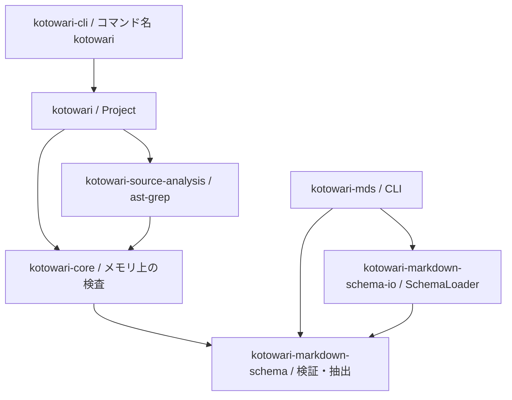

# 公開クレート再構成の設計案

今回は公開しない。既存CLIの動作を保ち、Rustアプリからも機能を使える構成へ移すための仕様案である。
この文書は構成と利用手順を説明する資料であり、仕様の正本はリンク先のIR、採用理由は[決定記録](../decision/records/2026-10-03-public-crate-api.md)にある。
コード例は提案APIの利用順を示す。現在のコードではまだコンパイルできず、実装時に外部利用のコンパイルテストへ移す。

## 何を使えばよいか

| したいこと | 依存するパッケージ | 最初の入口 |
|---|---|---|
| リポジトリを検査・問い合わせしたい | `kotowari` | `Project` |
| 未保存のIRを解析したい、用意済みの入力で検査したい | `kotowari-core` | `ir::parse`、`ReadModel::build`、`Inspection::build` |
| ソース文字列からテストや公開要素を取りたい | `kotowari-source-analysis` | `Analyzer` |
| Markdown文字列をスキーマで検証・抽出したい | `kotowari-markdown-schema` | `Schema`、`Document`、検証・抽出関数 |
| ファイルやURLからスキーマも取得したい | `kotowari-markdown-schema-io` | `SchemaLoader` |
| コマンドとして使いたい | `kotowari-cli`、`kotowari-mds` | 実行コマンド名は従来どおり |

ライブラリの通常の入口は用途ごとに選ぶ。内部の型を使うためだけに追加のクレートを指定する必要はなく、入口で必要な型を再公開する。
[クレート境界の仕様](../ir/core/library-crates.md)

## 依存方向

矢印の先が依存先である。Tokio対応はI/O側の任意featureに置く。



core内部はIR・出典と判断の記録・テスト対応・変異結果・変更照合・計画書・読み取り結果のモジュールに分ける。
Git取得とCLI表示は含めない。ソース解析を別クレートにすることで、IRだけの利用にast-grepを要求しない。
変更照合の比較用モデルはcoreが持ち、Git取得側がその型を構築する。

## Projectを使う

```rust
use kotowari::{Project, ProjectOptions};

let project = Project::new(ProjectOptions::new(std::env::current_dir()?)?);
let report = project.check()?;
for finding in report.findings() {
    // 表示・記録するかは、このアプリが決める。
}

let read = project.read()?;
let items = read.list();
let detail = read.query("REQ-core-001")?;
```

`check()`などの簡便な操作は毎回必要な入力を読む。繰り返し使う場合は`read()`または`inspect()`の結果を保持する。
保持した結果への操作はファイルを読み直さない。元のファイルを変更しても結果は変わらず、再読込によって反映する。
これは読込中のファイル群が同時点だったという保証ではない。

`read()`は一覧と問い合わせに必要な範囲を読む。`inspect()`はガイド・面・照合記録など、設定で有効な検査範囲も読む。
壊れたガイドのために従来の`list`が失敗する、といった互換性の破壊を避ける。
計画書と変異結果の検査には、従来どおりIRを要求しない。

[操作と失敗の仕様](../ir/core/library-api.md) / [入力と寿命の仕様](../ir/core/library-inputs.md)

## メモリ上の入力

IR解析だけなら、論理パスと文字列を`ir::parse`に渡し、`IrOptions`でIRの置き場を指定する。IDが欠けた項目も、取得できた内容・元の行・指摘を読み取れる。
CLIの一覧に載せられない項目を、解析結果から捨てない。

プロジェクト全体に相当する検査では、IRだけでなく出典や発見済みテストなどの入力を渡す。
必須の入力群が未提供なら`InputMissing`を返す。テスト情報を提供済みの空集合として渡した場合は、通常の「テストがない」指摘を返す。
ライブラリは渡されていないファイルを勝手に探しにいかない。
出典には判断の記録以外の通常Markdownも含める。テスト・面の情報は発見結果だけでなく、解析時の指摘と対象ファイルの情報を保持する。
入力群ごとの必須条件は[入力表](../ir/core/library-inputs.md#TBL-core-042)に定め、未申告の個別ファイルがないことは呼び出し側が保証する。

論理パスはプロジェクト基準からの相対パスとする。IRの置き場が`docs/ir`なら、`docs/ir/core/example.md`のように渡す。
正規化後に同じパスが同じ入力群へ重複した場合は拒否する。I/O入口の作業開始位置は絶対パスを受け、後からプロセスの現在位置を変更しても基準は変わらない。
[パスの仕様](../ir/core/library-paths.md)

## Markdownを検証して抽出する

```rust
use kotowari_markdown_schema::{
    Document, Schema, ValidationOptions, extract_partial, extract_validated,
};

let schema = Schema::parse(schema_yaml)?;
let document = Document::parse(markdown)?;
let options = ValidationOptions::default();

let checked = extract_validated(&schema, &document, &options);
let partial = extract_partial(&schema, &document, &options);
```

通常は`extract_validated`を使う。文書が違反していれば指摘を返し、検証済みの値を返さない。
修正途中の文書からも値を取りたい場合は`extract_partial`を使い、指摘と取得できた値の両方を読む。
スキーマは意味検証を通した後に変更できない。検証を迂回したスキーマを文書検査に渡せない形にする。
抽出したJSON値には既存の`serde_json::Value`を使い、独自のJSON型は作らない。

既存CLIの`values`と`ast --schema`は部分抽出の値を使うため、文書の違反だけで新しく失敗することはない。
ファイル・URL取得には`SchemaLoader`を使い、取得・キャッシュの規則をCLIと共用する。

[純粋な入口](../ir/schema/library.md) / [検証と抽出](../ir/schema/library-extraction.md) / [I/O](../ir/schema/library-io.md)

## Tokioから呼ぶ

`kotowari`またはスキーマI/Oの`tokio` featureを有効にし、`AsyncProject`または`AsyncSchemaLoader`を使う。
利用者が起動したTokio上で待ち、内部では同期処理を`spawn_blocking`へ渡す。
検査ロジックを非同期用に複製しない。

```rust
use kotowari::{AsyncOptions, AsyncProject};

let runner = AsyncProject::new(project, AsyncOptions::default());
let report = runner.check().await?;
```

既定の同時実行数は1。オブジェクトの複製は同じ枠を共有し、別々に作った実行用オブジェクトは別の枠を持つ。
実行枠を待つ間にキャンセルした仕事は投入しない。投入後は待機をやめても完了まで枠を保持する。
開始済みの処理を止める機能は今回提供しないため、待機をやめた後にもGit実行やキャッシュ書込みが続く場合がある。

[非同期APIの仕様](../ir/core/library-async.md)

## 実装計画へ引き継ぐ条件

- CLIの既存契約テストを維持し、外部利用例を各ライブラリの契約テストへ移す。
- crate単体のテストで、そのcrateの公開契約を確認できるようにする。
- パッケージに埋込スキーマを含め、リポジトリ外で配布物だけからビルドできることを検証する。
- 未公開のworkspace依存はローカルで解決して検証し、crates.ioへアップロードしない。
- 同期のみ・Tokio有効の両方と、実行枠・待機キャンセルの動作を検証する。
- kotowari系とスキーマ系は別の版系列を保ち、各系列内の版を揃える。公開順序と既存リリーススクリプトを新構成に合わせる。
- overviewは別計画で新構成へ載せる。将来の検査結果の統合先は`kotowari`であり、coreはoverviewに依存しない。

実際の公開、自動公開CI、overviewの実装は今回の実装計画に含めない。
